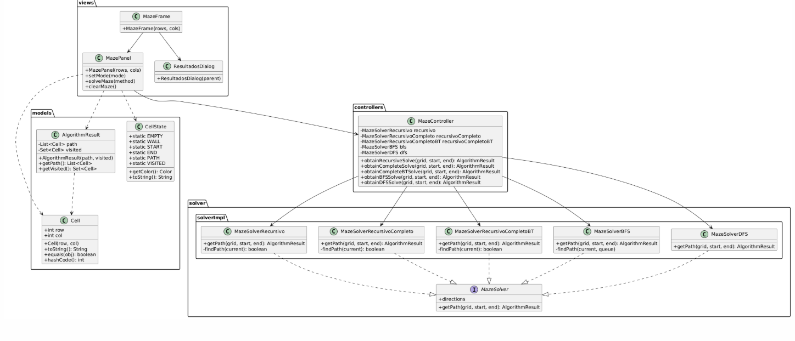
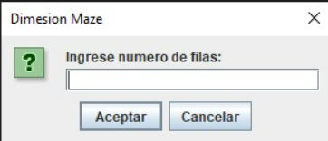
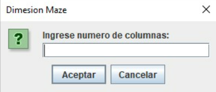
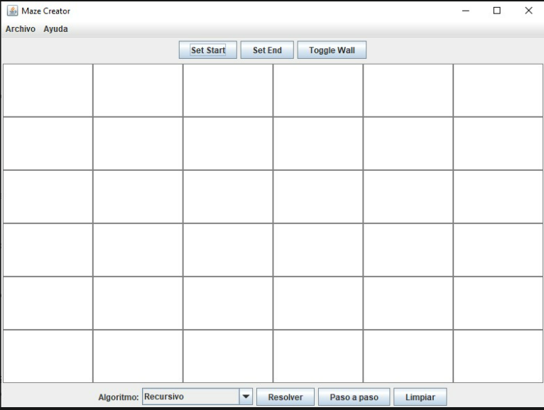
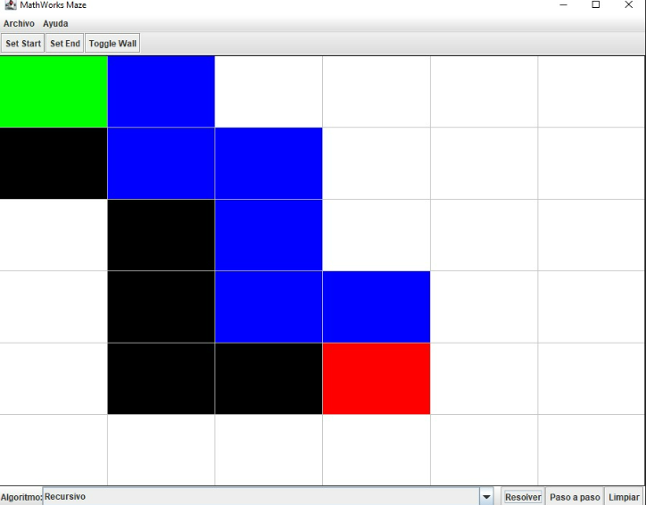
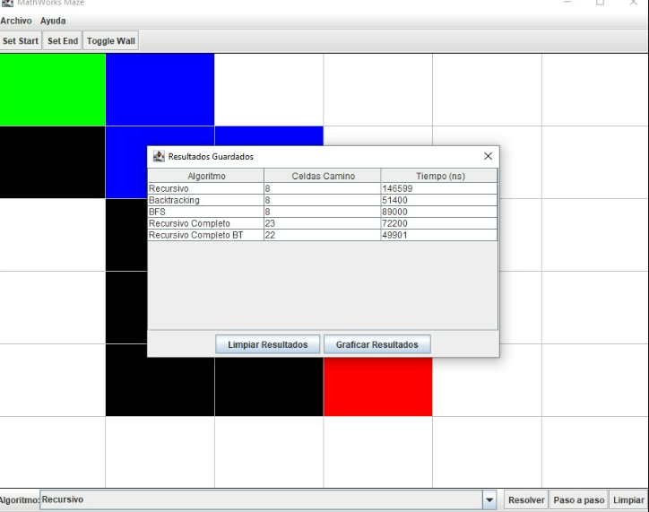
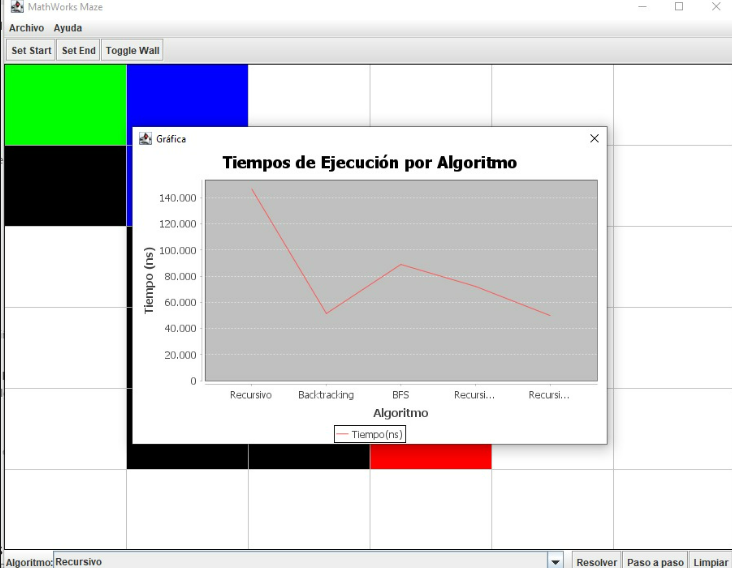
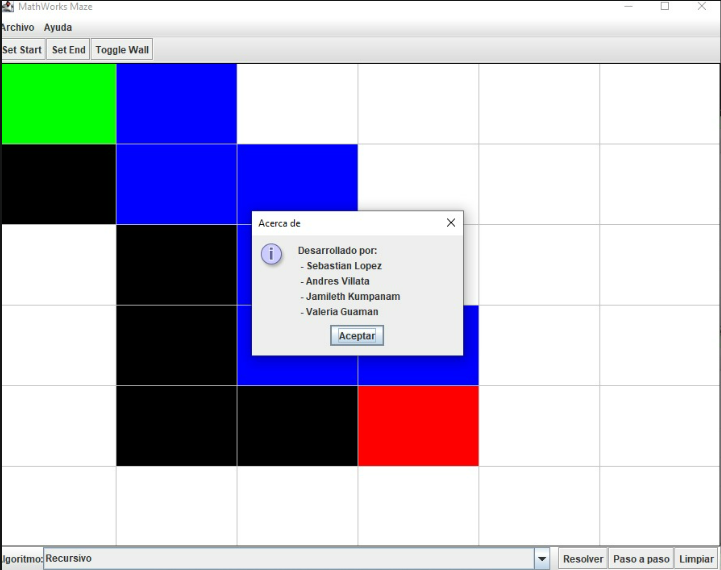

#  Proyecto Final – Estructura de Datos  
## Explorador de Laberintos con Algoritmos de Búsqueda  
---
## Índice  

1. [Carátula](#1-carátula)  
2. [Objetivos](#2-objetivos)  
3. [Marco Teórico](#3-marco-teórico)  
   - [Diagrama UML](#diagrama-uml)  
   - [Estructura del Proyecto](#estructura-del-proyecto)  
   - [Algoritmos Implementados](#algoritmos-implementados) 
   - [Como funciona el proyecto](#como-funciona-el-proyecto) 
4. [Resultados](#4-resultados)  
5. [Conclusiones](#5-conclusiones)  
6. [Recomendaciones](#6-recomendaciones)  

---
## 1. Carátula  

   
**Universidad:** Universidad Politecnica Salesiana  
**Asignatura:** Estructura de Datos  
**Estudiante:** Kelly Valeria Guaman Leon,
                Jamileth Estefania Kumpanam Segarra,
                Juan Sebastian Lopez Condo,
                Emilio Andres Villalta Pardo
**Correo institucional:** kguamanl3@est.ups.edu.ec
                          jkumpanam@est.ups.edu.ec
                          jlopezc34@est.ups.edu.ec
                          evillaltap@est.ups.edu.ec

---
## 2. Objetivos  
- Entender y utilizar métodos de búsqueda en configuraciones de laberintos.
- Desarrollar habilidades en la visualización y análisis de trayectorias óptimas. 
- Crear una interfaz gráfica dinámica con Java Swing.
- Evaluar de manera visual la eficacia de cada método.

---
## 3. Marco Teórico  

### Diagrama UML  

El sistema está dividido en:
- **Solver:** contiene las implementaciones de cada algoritmo.
- **Modelo:** estructuras como `Cell` y `CellState`.
- **Vista:** interfaz gráfica (`MazeFrame.java`) que muestra el laberinto.
- **Controlador:** maneja la interacción y coordinación (`MazeController.java`).

---

### Estructura del Proyecto  

src/
├── MazeApp.java
├── controllers/
│   └── MazeController.java
├── models/
│   ├── Cell.java
│   ├── CellState.java
│   └── SolveResults.java
    └── SolveResults.java
├── solver/
│   ├── MazeSolver.java
│   └── solverImpl/
│       ├── MazeSolverBFS.java
│       ├── MazeSolverDFS.java
│       ├── MazeSolverRecursivo.java
│       ├── MazeSolverRecursivoCompleto.java
│       └── MazeSolverRecursivoCompletoBT.java
└── views/
    └── MazeFrame.java
---
##  Algoritmos Implementados

- **DFS (Depth First Search):**  
  Búsqueda en profundidad. Explora lo más lejos posible en cada rama antes de retroceder.  
  *No garantiza encontrar el camino más corto.*

- **BFS (Breadth First Search):**  
  Búsqueda en anchura. Explora todos los nodos vecinos antes de pasar al siguiente nivel.  
  *Encuentra la ruta más corta (en número de aristas) en grafos no ponderados.*

- **Recursivo Simple:**  
  Implementación básica recursiva que encuentra una salida válida sin optimización.

- **Recursivo Completo:**  
  Explora todas las rutas posibles entre un nodo de origen y uno de destino.  
  *Útil para obtener todas las soluciones posibles, aunque no es eficiente.*

- **Recursivo Backtracking:**  
  Técnica que prueba caminos y retrocede si detecta que un camino no lleva a la solución.  
  *Eficiente para resolver laberintos y problemas donde se requiere buscar y deshacer decisiones.*
---

## ¿Cómo funciona el proyecto?

Este proyecto permite crear y recorrer grafos no dirigidos desde consola. Funciona completamente en memoria y está compuesto por clases simples (`Nodo`, `Arista`, `Grafo`, y `Main`). 

El flujo del programa es el siguiente:

1. **Inicio**: Al ejecutar el programa, se muestra un menú en consola.
2. **Agregar Nodos**: El usuario puede ingresar nodos con identificadores únicos.
3. **Agregar Aristas**: Se conectan dos nodos existentes, creando una relación bidireccional.
4. **Mostrar Grafo**: Se imprime la lista de adyacencia completa.
5. **Buscar Rutas**: El usuario elige un algoritmo para buscar camino entre dos nodos:
   - DFS (profundidad)
   - BFS (anchura)
   - Recursiva simple
   - Recursiva completa
   - Backtracking
6. **Resultado**: Se imprime el camino encontrado o un mensaje indicando que no existe.
7. **Salir**: El usuario puede cerrar el programa desde el menú.
---
## Resultados

## Conclusiones

- El proyecto muestra la manera de representar y manejar un grafo no dirigido mediante el uso de estructuras de datos elementales   en Java, tales como listas y mapas.
- Se logró implementar múltiples algoritmos de recorrido, cada uno con fortalezas y limitaciones distintas:
  - DFS es eficiente para encontrar cualquier camino, pero no garantiza el más corto.
  - BFS garantiza la ruta más corta, ideal para grafos no ponderados.
  - Los métodos recursivos permiten estudiar la exploración de rutas con distintas estrategias.
- La implementación sin frameworks ni bases de datos refuerza el entendimiento del funcionamiento interno de cada algoritmo.

---
##  Recomendaciones

- **Extensión futura**: implementar pesos en las aristas y agregar algoritmos como Dijkstra o A* para buscar rutas óptimas en grafos ponderados.
- **Interfaz gráfica**: desarrollar una GUI como java Swing para visualizar nodos y rutas gráficamente.
- **Validaciones**: agregar más validaciones para evitar nodos duplicados, aristas inválidas o entradas incorrectas del usuario.
- **Pruebas unitarias**: incluir tests automáticos para verificar el comportamiento de los algoritmos frente a distintos escenarios.

